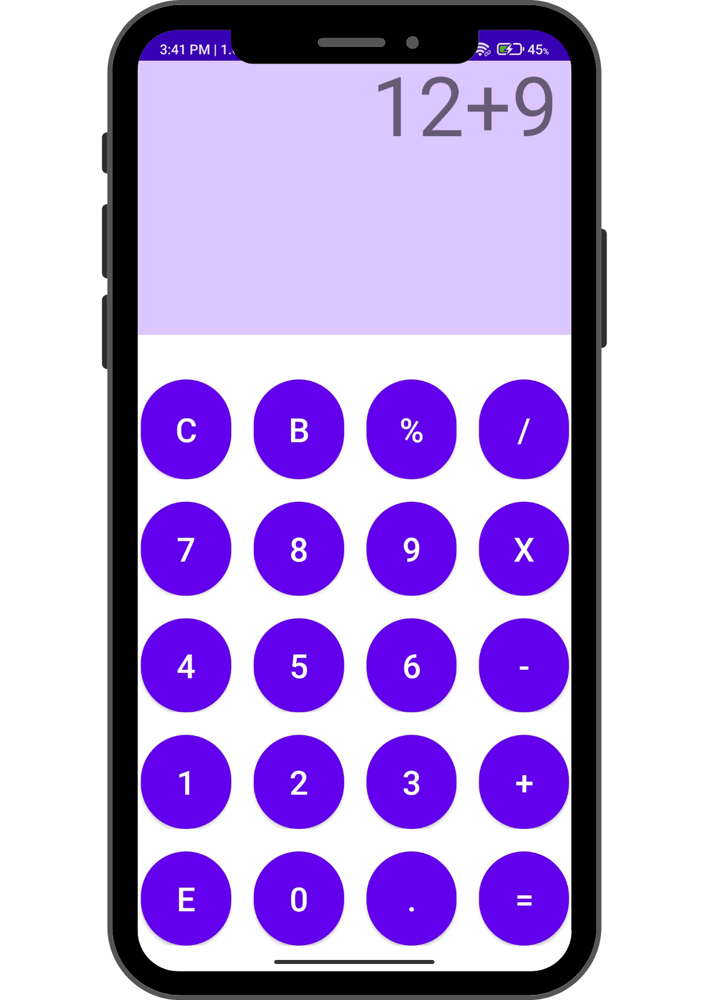

<h2>MC Calculator</h2>
This Calculator is build for anroid it is made using Linearlayout completely, It performs all the basics functions of calculation i.e., addition, subtraction, multiplication, division.

<h3>Working Image</h3>

